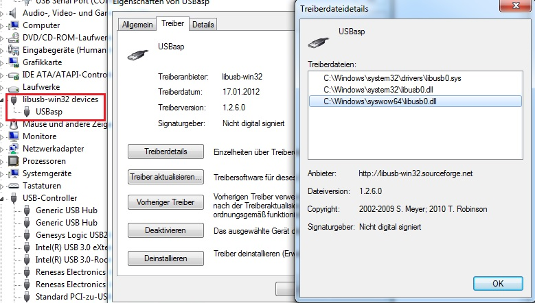
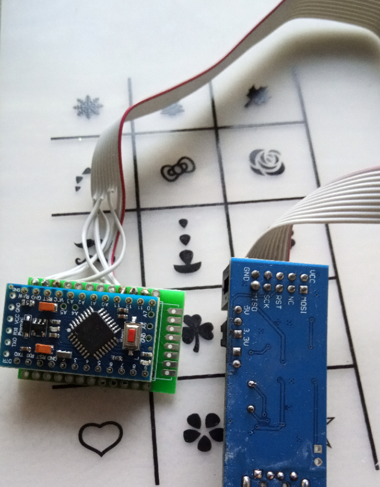
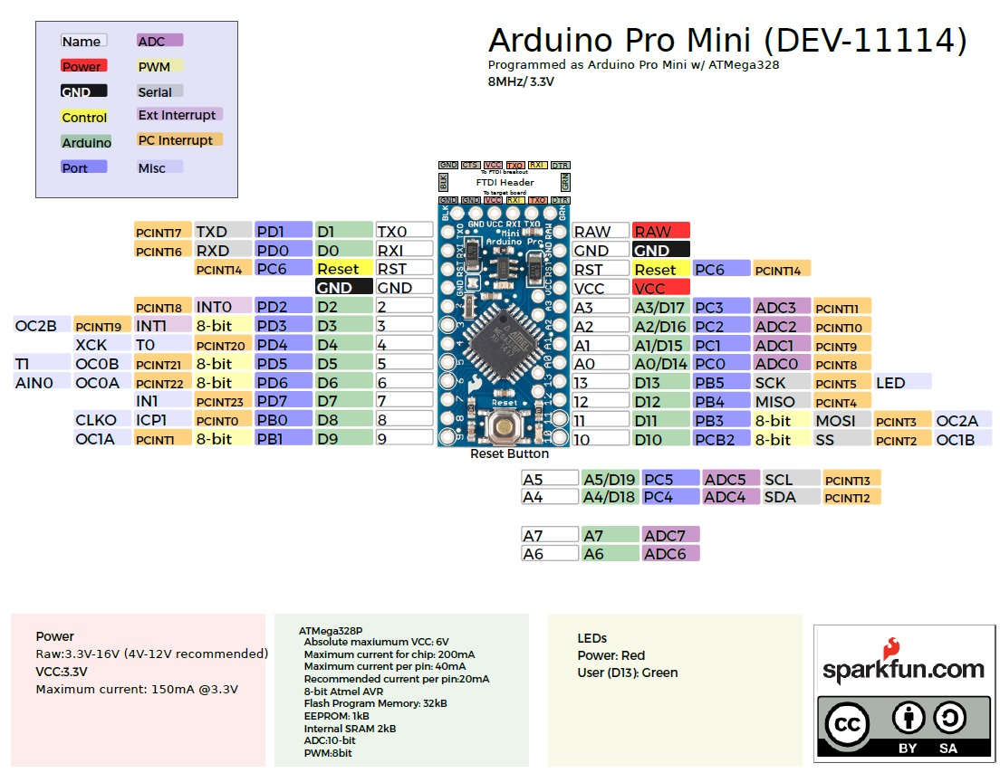
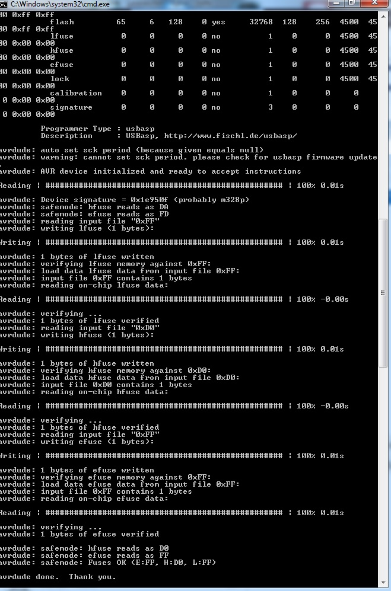

##Change Fuse Bits of Arduino Pro Mini
# benötigte Hardware
 * 1x Arduino Pro Mini **ATmega328P (3.3V/8MHz)**
 * 1x [USB ISP Programmer für ATMEL AVR](https://de.aliexpress.com/item/1LOT-New-USBASP-USBISP-AVR-Programmer-USB-ISP-USB-ASP-ATMEGA8-ATMEGA128-Support-Win7-64/32724669918.html)

1. Anleitung zur Instalation des Treibers und Avrdude hier http://stefanfrings.de/avr_tools/#avrdude

Das Gerät sollte dann wie auf den Bild zu sehen Installiert sein.

2. Verbinden des Ardinos mit dem ISP Adapter Hilfreich ist eine Lochrasterplatine oder auch ein HB-Uni-Mini :) 

3. Kommandozeile Öffnen und folgenden Befehl eingeben: avrdude -v -pm328p -cusbasp -Ulfuse:r:-:h -Uhfuse:r:-:h -Uefuse:r:-:h  

Wenn Ihr alles richtig gemacht habt sieht es wie folgt aus.

Jetzt sind die Fuse Bits geändert! 
-> Jetzt Schaltet der Arduino bei Batteriebetriebt nicht mehr bei 2,7V aus! Dieses hat sehr oft zu folge gehabt das dass Funkmodul unkontroliert Daten sendet und DC auf 100% Ansteigt und nix mehr geht.
